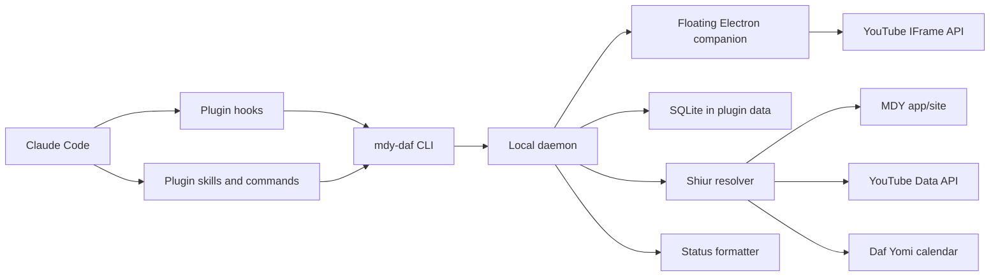

# Technical Architecture

## Summary

`mdy-daf-companion` should be a Claude Code plugin with a local daemon. Claude Code hooks provide lifecycle signals; the daemon owns playback, resolver state, stats, and persistence; a floating Electron companion embeds the official YouTube video through the local daemon.



## Components

### Plugin Manifest

Location: `mdy-daf-companion/.claude-plugin/plugin.json`

Purpose:

- Identify the plugin.
- Declare version, description, author, license, homepage, repository.
- Later, define user config once validated against the latest Claude Code schema.

### Hooks

Location: `mdy-daf-companion/hooks/hooks.json`

Purpose:

- Receive Claude Code lifecycle events.
- Forward compact event payloads to the daemon.
- Exit quickly.

Initial events:

- `SessionStart`: ensure daemon is running, maybe open/prepare player.
- `UserPromptSubmit`: resume if enabled and allowed.
- `Notification` with `permission_prompt` and `idle_prompt`: pause and save.
- `Stop`: pause and save.
- `StopFailure`: pause and save.
- `SessionEnd`: pause, close coding session, flush stats.
- `PreCompact`: flush state.
- `PostCompact`: refresh context/status.

### CLI

Location: `mdy-daf-companion/bin/mdy-daf`

Purpose:

- Cross-platform command interface used by hooks, skills, and users.
- Commands:
  - `start-daemon`
  - `hook`
  - `play`
  - `pause`
  - `resume`
  - `status`
  - `stats`
  - `resolve`
  - `settings`
  - `doctor`

Implementation target:

- TypeScript compiled to a Node executable.
- Production build should provide Unix and Windows wrappers.

### Daemon

Purpose:

- Keep one process per user session or per plugin data directory.
- Own local HTTP/WebSocket/IPC API.
- Launch or find the player window.
- Resolve current shiur.
- Translate Claude lifecycle events into playback state changes.
- Write stats to SQLite.
- Expose status JSON to the CLI.

Daemon endpoints:

- `POST /hook`
- `POST /play`
- `POST /pause`
- `POST /resume`
- `POST /api/progress`
- `POST /api/resolve`
- `POST /api/video`
- `GET /status`
- `GET /companion`
- `GET /api/dashboard`
- `GET /health`

Daemon lifecycle invariants:

- Startup hydrates in-memory `currentVideoId` from persisted settings so status and companion state survive process restarts.
- Detached daemon reuse is allowed only when runtime identity matches. Startup should restart healthy stale daemons when plugin root mismatches or runtime build metadata is newer than daemon start metadata.
- On Windows, plugin-root identity checks should be case-insensitive.

### Player

Purpose:

- Embed official YouTube video through the IFrame API.
- Report time updates to daemon.
- Accept play/pause/seek/video commands.
- Persist window state.

Implementation target:

- Local web app served by daemon inside Electron.
- Floating Electron companion launched by the runtime.
- Dashboard/stats view rendered inside the same Electron companion through `#stats`; no standalone browser dashboard route.
- Production choice is Electron-only:
  - Electron adds packaging weight.
  - A dedicated companion gives reliable focus, always-on-top behavior, window placement persistence, and no regular browser-tab clutter.

Recommendation:

- For public v1, use the Electron companion as the only video playback surface. If Electron is missing, report setup guidance and keep Claude Code running; do not open a regular browser fallback.
- Public npm releases install Electron as a runtime dependency and launch the companion through `node_modules/electron/cli.js`. Electron Packager scripts remain for optional native smoke testing and future signed app distribution; generated `out/` folders are not part of the npm tarball.

### Resolver

Purpose:

- Map date and preferences to a specific video.

Inputs:

- Date and timezone.
- Daf Yomi calendar result.
- User preference: language, format, current/backlog behavior.
- Cached results.
- Source adapters.

Adapters:

- `DafCalendarAdapter`: Hebcal or equivalent.
- `MdyAppAdapter`: official app metadata if discoverable and stable.
- `YouTubeDataAdapter`: official API when user provides key or plugin can safely use one.
- `YouTubeExtractAdapter`: fallback extraction.

Output:

```json
{
  "masechta": "Menachos",
  "daf": 99,
  "date": "2026-04-20",
  "language": "english",
  "format": "full",
  "videoId": "example",
  "title": "English Full Daf Menachos Daf 99",
  "source": "youtube-data",
  "confidence": 0.92,
  "durationSeconds": 3660
}
```

Resolver behavior notes:

- Candidate scoring remains strict for exact daf/masechta title matches.
- Date fallback is handled above scoring: if no confident current-date match exists, resolver retries with a one-day lookback window.

### Persistence

Use SQLite in `CLAUDE_PLUGIN_DATA/state.sqlite`.

Rules:

- Writes should be small and frequent enough to avoid losing progress.
- Use transactions for event ingestion and progress updates.
- Store source metadata separately from user watch stats.
- Do not store source code, prompts, transcript text, or tool inputs by default.

### Status Line

Purpose:

- Return short text for Claude Code status line.

Behavior:

- If daemon is healthy, read current status.
- If daemon is down, return nothing or a short inactive indicator.
- Avoid expensive work.
- Target under 100 ms.

Example:

```text
MDY Menachos 99 18/61m watched | code 42m
```

## Lifecycle

### Session Start

1. Hook receives `SessionStart`.
2. CLI starts daemon if needed.
3. Daemon opens today's coding session row.
4. Daemon resolves today's shiur in background.
5. If user config permits, player opens paused or starts after first work signal.

### Prompt Submitted

1. Hook receives `UserPromptSubmit`.
2. Daemon records active coding state.
3. If safe, daemon resumes playback.

### Claude Stops Or Needs User

1. Hook receives `Stop`, `StopFailure`, or `Notification`.
2. Daemon pauses YouTube player.
3. Player sends final current time.
4. Daemon saves progress and closes active watch segment.

### Session End

1. Hook receives `SessionEnd`.
2. Daemon pauses player.
3. Daemon closes coding session.
4. Daemon flushes stats.

## Failure Modes

- No network: use cache; show unresolved status; do not fail Claude Code.
- YouTube blocked: pause automation; show actionable `doctor` result.
- MDY source changed: fall back to YouTube title search.
- Calendar advanced before upload: keep strict scoring and apply one-day date lookback before reporting unresolved state.
- Daemon crashed: next hook restarts it.
- Daemon runtime drift after rebuild: startup should replace stale healthy daemons to avoid old logic serving new sessions.
- Player closed: daemon marks player unavailable; next resume reopens if allowed.
- Companion opened before shiur resolution: page should poll status and initialize/cue the YouTube player when a video ID arrives later.
- Shabbos guard active: do not auto-start; status line can show "guarded" if configured.

## Security And Privacy

- Bind daemon to localhost only.
- Use a random per-install token for local API calls.
- Accept token query parameters only for the Electron `/companion` bootstrap route; all daemon API calls should use `Authorization: Bearer`.
- Avoid broad filesystem reads.
- Do not inspect project source files for stats.
- Redact cwd or hash it for project-level analytics.
- Keep API keys in plugin data or OS keychain, never in the repository.
